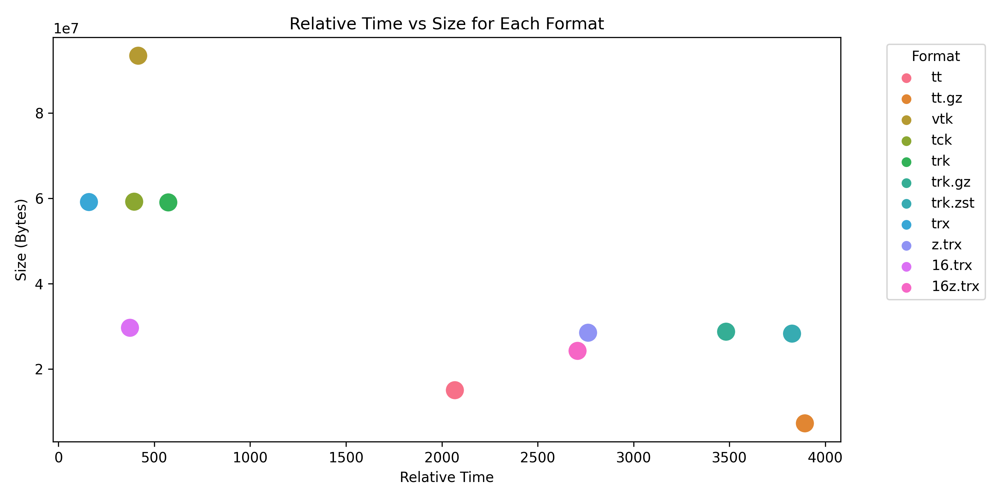

## About

This is a minimal JavaScript reader for the [TRX tractography file format](https://github.com/tee-ar-ex/trx-spec/blob/master/specifications.md). Previously, most tractography tools used their own proprietary [format](https://www.nitrc.org/plugins/mwiki/index.php/surfice:MainPage#Supported_Formats) such as BFLOAT, niml.tract, [PDB](https://github.com/vistalab/pdb_files), [TCK](https://mrtrix.readthedocs.io/en/latest/getting_started/image_data.html#tracks-file-format-tck), [TRK](http://trackvis.org/docs/?subsect=fileformat) and VTK. The TRX format was developed from community [discussions](https://github.com/nipy/nibabel/issues/942) to address the [limitations of the existing formats](https://docs.google.com/document/d/1GOOlG42rB7dlJizu2RfaF5XNj_pIaVl_6rtBSUhsgbE/edit#heading=h.c6igqydj1hrf) and the needs of the users. This reader supports all the features of TRX including data-per-vertex, data-per-streamline and groups.

## Live Demo

[NiiVue provides a WebGL live demo of this code](https://niivue.github.io/niivue/features/tracts.html). This can be tested on any device (computer, laptop, phone). A sample TRX file is loaded by default, but users can drag and drop new streamlines in the niml.tract, TCX, TRK, TRX, and VTK formats.

## Dependencies

This software uses the following packages that can be installed using [npm](https://nodejs.org/en/download/package-manager/) with the command `npm install gl-matrix fflate fzstd`:

 - [fflate](https://github.com/101arrowz/fflate) decompresses gzip and zip archives (trk, trx).
 - [gl-matrix](https://github.com/toji/gl-matrix) provides matrix and vector types and operations.
 - [fzstd](https://github.com/101arrowz/fzstd) decompresses zstd archives (trk).

## Trouble shooting

This code should be supported by all modern web browsers. If you want to use this code from the command line using node, your node version must be at least 14.11.2. Run the command `node --version` to determine your node version. Linux and MacOS users can often upgrade node using the command `npm install n -g` (though note that some operating systems freeze software versions). Alternatively, upgrade node from the [web site](https://nodejs.org/en/download/).


## Node.JS Command Line Demo

The module `streamlineIO.mjs` provides JavaScript reading for streamlines in the TCX, TRK, TRX, and VTK formats. The included file `bench.mjs` demonstrates these capabilities by loading a streamline 11 times and reporting details regarding file size, loading time, and streamline properties.

Assuming you have [node 14.11.2 or later](https://nodejs.org/en/download/) you can run the demo:

```
$ git clone https://github.com/tee-ar-ex/trx-javascript
$ cd trx-javascript
$ npm install gl-matrix fflate fzstd
$ node bench.mjs dpsv.trx
dpsv.trx	Size	626180	Time	302
Vertices:95865
 First vertex (x,y,z):-24.25,-22.09375,-26.90625
Streamlines: 460
 Vertices in first streamline: 208
dpg (data_per_group) items: 0
dps (data_per_streamline) items: 1
  'DataSetID' items: 460
dpv (data_per_vertex) items: 1
  'z' items: 95865
Header (header.json):
{
  DIMENSIONS: [ 314, 378, 272 ],
  VOXEL_TO_RASMM: [
    [ 0.5, -0, 0, -78.5 ],
    [ -0, 0.5, 0, -112.5 ],
    [ -0, -0, 0.5, -50 ],
    [ 0, 0, 0, 1 ]
  ],
  NB_VERTICES: 95865,
  NB_STREAMLINES: 460
}
Done
```

## Implementation Details

There are several important considerations regarding supporting the TRX format with JavaScript. The provided minimal reader makes some tradeoffs that may not be appropriate for all use cases.

 - The TRX [specification](https://github.com/tee-ar-ex/trx-spec/blob/master/specifications.md) allows streamline positions to use the float16 datatype, which is not native to JavaScript. This code converts these to float32.
 - Be aware that the specification stores NB_STREAMLINES values in the offsets array, with each value pointing to the start of that streamline One must use the length of the positions array or the header to infer the end of the final streamline. This code will populate return an offset array with NB_STREAMLINES+1 values to solve the [fencepost problem](https://icarus.cs.weber.edu/~dab/cs1410/textbook/3.Control/fencepost.html) for the final streamline. This simplifies and accelerates display code, but one must be aware of this modification.
 - The TRX specification requires little-endian order. The current code only supports little-endian systems. This should support all modern Android, iOS, macOS, Linux and Windows devices.
 - This tool uses [fflate](https://github.com/101arrowz/fflate) to decompress GZip and Zip files. During development we found that this library is much faster than the pako and jszip alternatives.

## Benchmark

The included JavaScript `bench` provides a method to evaluate performance. This benchmark is likely specific to JavaScript and so caution should be excercised in evaluating relative performance. The script will report the time to load a TRK, TCK, VTK or TRX file 10 times (it loads the tracts 11 times, and ignores the first run).

The graph below shows the time load the [left inferior fronto-occipital fasciculus (IFOF) ](https://brain.labsolver.org/hcp_trk_atlas.html) from the HCP1065 Population-Averaged Tractography Atlas (Yeh, 2022). This has with 21209 streamlines and 4915166 vertices. The different formats are generated with the [tff_convert_tractogram.py](https://github.com/tee-ar-ex/trx-python) script.The benchmark was run on a MacBook laptop with a M2 Pro CPU. The ideal format would be both fast to load (to the left on the horizontal axis) and have a small file size (toward the bottom in the right axis). However, compression typically trades load time for file size. Here all data is loaded from a local solid state drive, whereas smaller files would benefit if data was loaded using a slow internet connection. The following file formats are illustrated (except where noted, both positions and indices are stored with 32-bit precision):

 - tt: The [DSI Studio format](https://dsi-studio.labsolver.org/doc/cli_data.html) is very compact. The vertex position is stored as 1/32nd of a voxel, so it may be slightly lossy for some data.
 - tt.gz: Gzip compressed DSI-Studio.
 - vtk: streamlines saved by an [undocumented](https://discourse.vtk.org/t/upcoming-changes-to-vtkcellarray/2066) extension to the [VTK legacy file format](https://vtk.org/wp-content/uploads/2015/04/file-formats.pdf) (converted with `--offsets_dtype uint32`).
 - tck: [MRtrix format](https://mrtrix.readthedocs.io/en/latest/getting_started/image_data.html#tracks-file-format-tck).
 - trk: The popular [TrackVis format](http://trackvis.org/docs/?subsect=fileformat).
 - trk.gz: Gzip compressed TrackVis.
 - trk.zst: ZStandard compressed TrackVis. Note that [native zstd decompression](https://github.com/neurolabusc/zlib-bench-python) is very fast, but the JavaScript decompressor is relatively slow.
 - trx: uncompressed TRX format.
 - z.trx: zip-compressed TRX format.
 - 16.trx: uncompressed TRX format using 16-bit floats for positions (which are not native to JavaScript).
 - 16z.trx: zip-compressed TRX format using 16-bit floats for positions (which are not native to JavaScript).


